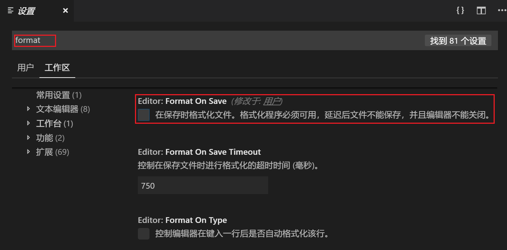
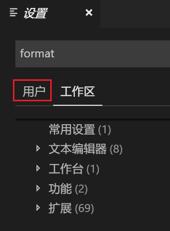
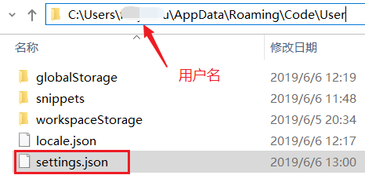
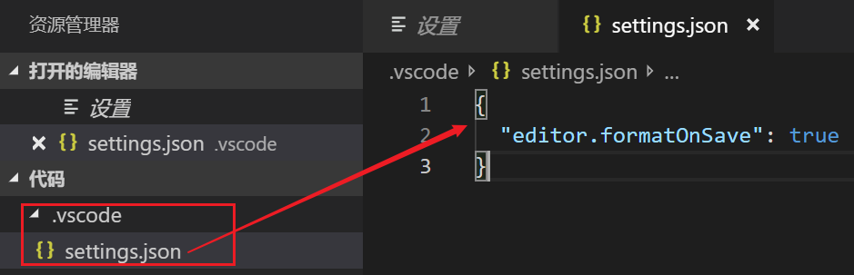
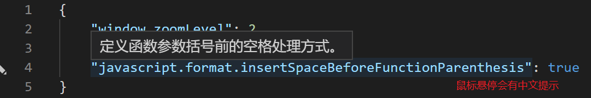
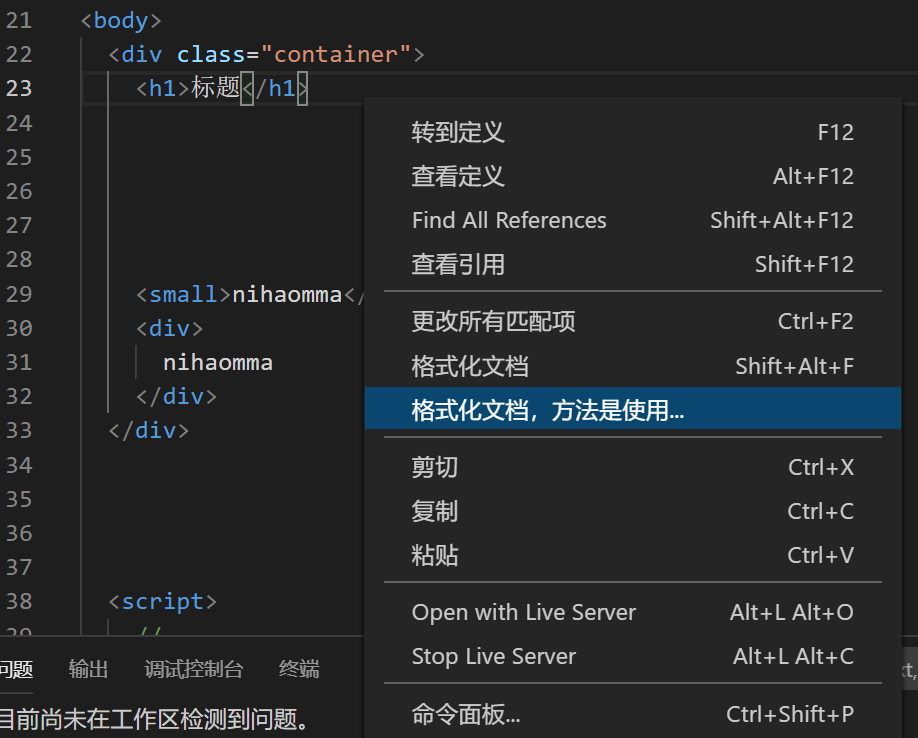
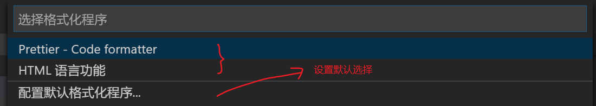
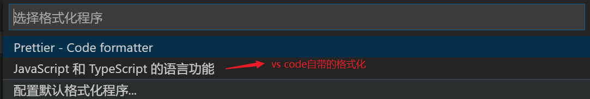

# vscode格式化

在写代码的过程中，整洁的，统一的格式会让代码更好读，也会减少出错的可能。所以，格式化是一个非常必须的功能。


## 内置的格式化功能

对于常见的文件格式，vscode本身就有`简单格式化`的功能。以.html文件为例：

```HTML
<div class='container'>
    <h1>vscode自带格式化功能</h1>
<div>
      右键->'格式化文档'
</div>
    
    
    
    <p>只能进行简单的格式化：如“缩进对齐”</p>
    <p>不能进行高级的格式化：如“去掉多余的空行”</p>
</div>
```

对于如上代码，格式化时（右键->'格式化文档'），只能进行`缩进对齐`，而更高级的 `去掉多余的空行`就做不到了。


同样，对于`.js`文件的格式化也有这个问题：它只能格式化，不能做更高级的功能，例如：提示你某个变量定义了，却没有使用。


## 保存时自动格式化

如果你不希望每次手动去格式化（右键->'格式化文档'），你也可以设置在保存时（按下`ctrl+s`）自动去格式化。要实现这一点，只需要去配置一下`设置`即可。

步骤：

- 快捷键`ctrl + ’` ，打开`设置`面板。vscode 及插件的设置全部集中在这里。



- 输入 format 关键字，以减少设置项的范围。找到`Format On Save`,打上勾就行了。
- 关闭设置选项卡，回到你的代码中，修改一些格式，例如打乱标签的对齐方式。再按下`ctrl+s` ，看看是否就自己自动格式化了。


设置选项卡中，我们可以做很多的设置工作，其基本操作流程就是：

- ctrl + ‘ 
- 输入关键字搜索。当然，也可以在左侧的树状菜单中自己找。
- 打上勾，或者是取消。


这个操作会经常做，这里先提醒下。 

## 理解`设置`选项卡

上面介绍的vscode的设置中，有一个注意事项：对vscode的设置有两个维度：



- 用户
- 工作区

### 用户 设置

它是对整个用户设置，就是说只要当前这个用户在使用vscode就统一使用这个配置，而不限于某个项目。如果你在用户这个维度进行设置，则你所做的设置会生成一个配置文件，路径是`C:\Users\某用户名\AppData\Roaming\Code\User\settings.json`（以win10为例）



（大概是这个位置，可能与操作系统有关。）

### 工作区 设置

这个设置只在当前工作区有效。对应会在本项目的根目录 下产生一个.vscode文件夹，下面有一个settings.json，其中就保存着你的配置。



如上所示的图中，表示开启了`保存时自动格式化` (editor.formatOnSaves)

### 修改json文件来更新设置

我们可以在图形化的界面中，通过鼠标进行操作来修改设置。


如上图示精确格式化javascript代码的一些设置项。也标出了如何进入对应的settings.json文件。

下面是一个setting.json的示例：

```json
{
    "window.zoomLevel": 2,// 把窗口放大2倍。你通过ctrl + '+' 就可以设置。放大之后，字大一些。 
    "editor.formatOnSave": true, // 保存时自动格式化
    "javascript.format.insertSpaceBeforeFunctionParenthesis": true,
}
```

如果你不认识第三句，也不要紧，在vscode中，对setting.json有丰富的提示功能：




我们可以把他人定义好的配置文件中的内容复制过来，在自己的配置文件中使用。同时也可以把自己的配置方法放出来共其它人，或者是同事一起使用。


## prettier格式化插件

如果你觉得vscode自带的格式化功能不够用，你也可以选择第三方的格式化插件。下面以prettier为例，进行介绍。


当然 ，先是安装这个插件。


### 设置成默认工具

安装成功之后，你再次打开某个.html文件（注意是.html文件，而不是其它类型），右键，此时与格式化相关的命令中会多出一个`格式化文档，方法是用使用...`




此时，由于vscode中有两个可以使用的格式工具：

- 自带的
- prettier

它就会聪明地问你，你要用哪一个？


你点击这个命令，出现如下：



你可以自己选择一个。当然，自带的格式化与prettier插件提供的格式化还是有明显的区。 以如下html代码为例：

```html
<div>
    
    
    <p>
      <a></a>
    </p>
    
    
</div>
```

以上代码有两处不符合格式：

1. a标签没有正确缩进。这个问题两种格式化功能都能做。
2. p标签前面有很多行空白行。这个问题自带的格式化功能就不能解决，而prettier可以`聪明地只保留前后各一个空行`，把其它的空行都删掉。


如果你把prettier设置成默认的格式化工具，则在配置文件中就会多出如下：

```json
{
  "window.zoomLevel": 2,
  "editor.formatOnSave": true,
  "javascript.format.insertSpaceBeforeFunctionParenthesis": true,
  "[html]": { // 把prettier设置成对html文件进行格式化的默认程序
    "editor.defaultFormatter": "esbenp.prettier-vscode"
  }
}
```

同样，如果你对.js文件也使用格式化命令，你看到的可能就是：



如果你也同样地选择prettier作为默认格式化工具，则在配置文件中就会再多出一条设置：

```json
{
  "window.zoomLevel": 2,
  "editor.formatOnSave": true,
  "javascript.format.insertSpaceBeforeFunctionParenthesis": true,
  "[html]": {// 把prettier设置成对html文件进行格式化的默认程序
    "editor.defaultFormatter": "esbenp.prettier-vscode"
  },
  "[javascript]": { // 把prettier设置成对js文件进行格式化的默认程序
    "editor.defaultFormatter": "esbenp.prettier-vscode"
  }
}
```


当然，如果你对prettier的格式化效果不满意，你也可以直接在settings.json中删除对应的项即可。同理，去使用其它 的格式化插件。


### 设置

.prettierrc