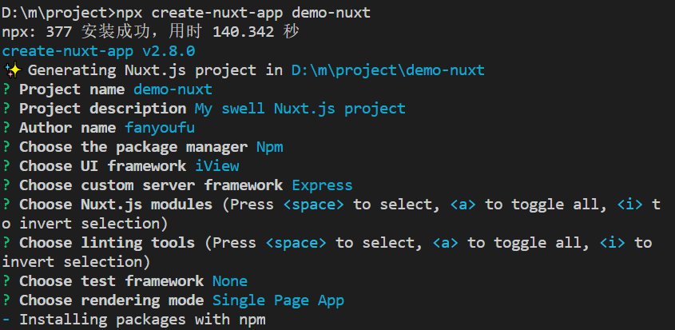

 

## 服务器端渲染

渲染是指把数据转成具体的dom节点的过程。你可以在两个地方进行这个操作：在服务器上，在客户端。

### 服务器端渲染

### 客户端渲染

### 优缺点

服务器端渲染：

好处：

对seo更友好；

坏处：

对服务器的压力更大


## 理解服务器渲染

把数据和视图渲染成html的过程在服务器上进行。这一点就是很久以前我们做网页的套路：php+smarty引擎。现在，又翻出来。

下面的示例中，我们通过vue库和vue-server-renderer这个插件，来实现这个过程：

- 用vue做视图
- 用vue-server-renderer来把vue实例转成html代码片断。

具体步骤如下：

1. 使用npm建立一个项目，并安装相关插件.

新建一个文件夹，cmd进入到这个文件夹下，通过 `npm init --yes`进行初始化操作。

安装依赖。这里以vue及[vue-server-renderer](https://ssr.vuejs.org/zh/api/#createrenderer)插件为例。

（1） 第一步：安装vue

（2） 第二步：安装vue-server-renderer插件

2. 新建立一个文件，名为index.js。其中代码如下：

```javascript
const Vue = require('vue');
const renderer = require('vue-server-renderer').createRenderer();

const app = new Vue({
  template: '<h1>hello world-{{name}}</h1>',
  data: () => {
    return {
      name: 'james'
    };
  }
});

renderer.renderToString(app, (err, html) => {
  if (err) {
    console.log(err);
    return;
  }
  console.log(html);
});
```

3. 测试效果

`node index.js`

你如果看到如下的输出;

`<h1 data-server-rendered="true">hello world-james</h1>`

就表示，这个已经成功了:把一个vue实例的内容，转成了html字符串


## 一个完整的服务器渲染的例子

在上例的基础上，引入express来充当服务器框架，快速启动一个web服务器。具体代码如下：

```javascript
const Vue = require('vue');
const renderer = require('vue-server-renderer').createRenderer();
const server = require('express')();

server.get('/index.html', (req, res) => {
  renderer.renderToString(app, (err, html) => {
    if (err) {
      console.log(err);
      return;
    }
    console.log(html);
    res.end(`<html><body>${html}</body></html>`);
  });
});
server.listen(8081, function() {
  console.log('http://localhost:8081/index.html');
});

const app = new Vue({
  template: '<h1>hello world-{{name}}</h1>',
  data: () => {
    return {
      name: 'james'
    };
  }
});

```

1. 运行node index.js; 

2. 在浏览器中`http://localhost:8081/index.html`访问结果。


## vue-hackernews-2.0

工程化的代码。

<https://github.com/vuejs/vue-hackernews-2.0>

直接打不开，loading不出来，可能是因为网络环境的原因：它使用的是外国的服务器，可能本地打不开。

这是vue 官方提供的服务器渲染的demo。可以去研究下。

## nuxt

这是一个第三方的脚手架工具，它具备交互式的操作方式 ，让我们从0开始去搭建一个应用。


npx

npm v5.2.0引入一个命令 npx.


npx create-react-app my-app

不需要提前安装全局命令

npm install -g create-react-app

create-react-app my-app;


### 安装工程代码

两种方式

1. 

`npx create-nuxt-app demo-nuxt`

2. `npm install -g create-nuxt-app   create-nuxt-app yourproject`




### 启动


### 基本配置

样式配置

- 安装 less需要的各种包

### 路由

在layout.vue中有一个容器 nuxt。

与vue中的路由使用相似，我们两个组件来表示路由的效果：

在vue中是: router-link, router-view。在nuxt是nuxt-link和nuxt。nuxt-link表示类似于a标签的跳转，而nuxt是表示容器


虚拟路由配置

与vue中的需要明确的路由配置不同，nuxt中的路由配置是由文件所在的位置及命名来确定的。


## 视图

### app.html

在根目录下使用app.html。它的默认结构如下：

```html
<!DOCTYPE html>
<html {{ HTML_ATTRS }}>
  <head {{ HEAD_ATTRS }}>
    {{ HEAD }}
  </head>
  <body {{ BODY_ATTRS }}>
    {{ APP }}
  </body>
</html>
```

你可以把它理解为一个默认的结构，{{APP}}表示一个占位符，在项目跑起来之后，会由layouts中的default.vue代替。

一般不要需要去改动它。


## asyncData

在每个页面组件加载之前，去异步请求数据。它是nuxt.js为我们额外提供的一个api。

```javascript
const axios = require('axios');
export default{法
    // 第一种写法
    asyncData(){
        return axios.get().then(res=>{
            return {list:res.data}
        })
    },
    // 第二种写法
    async asyncData(){
        let {data} = await axios.get();
        return {list:data}
    }
}
```

注意：

- 它的结果会自己合并到data属性中，


## 资源文件

- asset：会被webpack处理。例如，较小体积的图片可能会被处理成base64的图
- static：不会被webpack处理。


## vuex

store/index.js

```javascript
import Vue from 'vue';
import Vuex from 'vuex';
Vue.use(Vuex);

const store = () =>
  new Vuex.Store({
    state: {
      counter: 1
    },
    mutations: {
      add(state) {
        state.counter++;
      }
    }
  });

export default store;
```

注意：

1. store是一个函数，而不是一个对象。