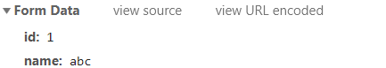
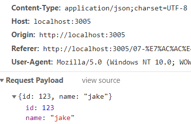
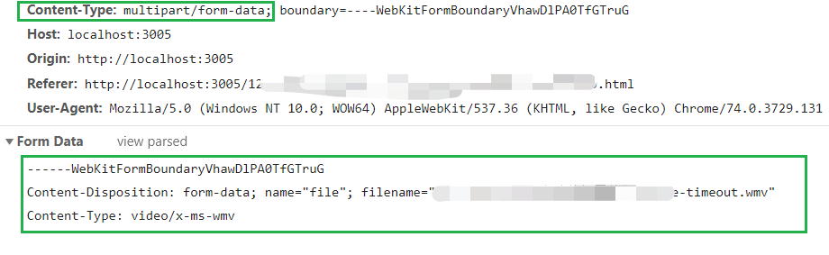

# 三种常见的 POST 提交数据方式对应的 content-type 取值

ajax 的用来从浏览器发送异步请求到服务器端，并根据返回值对页面进行局部更新。当然，在它访问服务器接口时，它也可以携带数据的，例如：用户注册时，要带上用户名和邮箱信息；用户发布留言时，要带上留言的内容等。 本文主要讨论如何去携带这些信息，及对应地在后端代码中如何去获取携带的数据。

## application/x-www-form-urlencoded

你可以在开发者工具的 network 面板中的观察 `content-type：application/x-www-form-urlencoded`，它传参时，可以看到请求体中的关键字：`Form Data`



### 原生 ajax 中使用

使用原生 ajax 时，通过 post 方式发送请求时要主动设置加上这一句。虽然现在很人使用原生 ajax 了，不过自己当作学习写写也不错的。

```javascript
var xhr = new XMLHttpRequest();
xhr.open("post", "common/post");
xhr.setRequestHeader("Content-type", "application/x-www-form-urlencoded");
xhr.send(`userName=${userName}&userPassword=${userPassword}`);
xhr.onload = function() {
  console.info(xhr.response);
};
```

### \$.ajax 中使用

如果你使用 jQuery 中提供了 ajax 相关方法时，则它的默认 content-type 就是这个`application/x-www-form-urlencoded`。所以，在你使用\$.post 时，并不需要特别的设置。

## application/json

如果你要传递的只是普通的键值对数据，例如:

```javascript
$.ajax({
  url: "./common/post",
  type: "post",
  data: { name: "jake", age: 30 }
});
```

application/json 这个 Content-Type 作为响应头大家肯定不陌生。实际上，现在越来越多的人把它作为请求头，用来告诉服务端消息主体是序列化后的 JSON 字符串。由于 JSON 规范的流行，除了低版本 IE 之外的各大浏览器都原生支持 JSON.stringify，服务端语言也都有处理 JSON 的函数，使用 JSON 不会遇上什么麻烦。

JSON 格式支持比键值对复杂得多的结构化数据，这一点也很有用。记得我几年前做一个项目时，需要提交的数据层次非常深，我就是把数据 JSON 序列化之后来提交的。不过当时我是把 JSON 字符串作为 val，仍然放在键值对里，以 x-www-form-urlencoded 方式提交。

axios 在发 post 请求时，就设置 content-type 是这个值。



它适合于传递比较复杂的，多级嵌套的 json 数据。

## multipart/form-data：

multipart/form-data 是指表单数据有多部分构成，既有文本数据，又有文件等二进制数据的意思。用于文件上传时。



- 使用 <form> 标签，并手动设置 enctype 属性。
- 通过 FormData()来构造传参
- 如果是通过 jQuery.ajax 来使用 FormData()的话，还要注意，去掉默认的 content-type 以及不要处理数据。

```javascript
$('#btn').click(function() {
    // 收集用户信息
    var fd = new FormData($('#myForm')[0]);
    $.ajax({
        url: 'common/post',
        type: 'post',
        data: fd,
        processData: false, // 不需要jquery去处理数据。 （2）
        contentType: false, // 不需要默认的contentType，而采用FormData自己的 （3）
        success: function(res) {
            console.info(res);
        }
    });
```

首先生成了一个 boundary 用于分割不同的字段，为了避免与正文内容重复，boundary 很长很复杂。然后 Content-Type 里指明了数据是以 mutipart/form-data 来编码，本次请求的 boundary 是什么内容。消息主体里按照字段个数又分为多个结构类似的部分，每部分都是以 --boundary 开始，紧接着内容描述信息，然后是回车，最后是字段具体内容（文本或二进制）。如果传输的是文件，还要包含文件名和文件类型信息。消息主体最后以 --boundary-- 标示结束

如何你采用这种方式去传递数据到后端，则需要后端代码的特殊支持，至少在 node+express 环境下，你需要安装类似于

const multipart = require('connect-multiparty');

var multipartMiddleware = multipart();

router.post('/post', multipartMiddleware, function(req, res) {

let d = Object.assign({}, req.body, {

​ \_t: Date.now(),

​ str: '服务器返回成功'

});

res.json(d);

});
