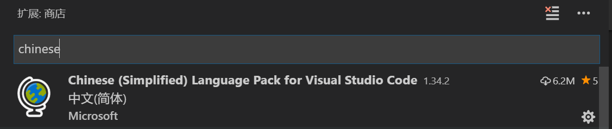
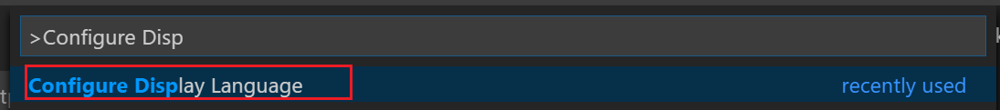
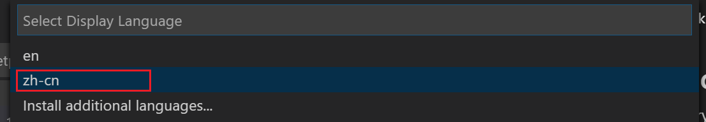

# 将 VSCode 设置成中文语言环境

初始安装时，使用的是英文包，所以界面菜单全是英文的。如果你想使用中文环境，可以以安装插件的方式去安装中文语言包。

步骤如如下：

1. 进入拓展安装
2. 安装指定插件`chinese Language Pack for Visual Studio Code`

3. 按要求重启 vscode。

4. 如果第三步没有起作用（或者后期你又想回到英文的操作环境） 你可以手动切换：

   （1）按键`ctrl+shift+p`,调出命令面板，输入“configure display language”，选中这个命令。

（2）然后，在弹出的下拉列表中，选择你刚才安装的语言包 。

5. 值得注意的是，如果你升级了 vscode，好像它会自动退回到英文语言包（这一点我并不确定），这里你只需要通过`configure display language`重新切换一次语言包就可以了。
